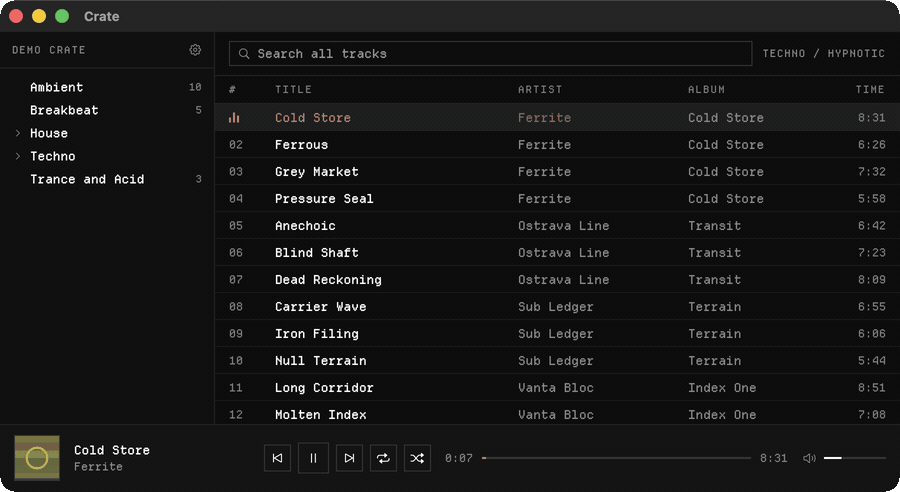

<div align="center">


# Crate

**A macOS music player that plays your folders, in order, and nothing else.**

[](#install)
[](https://swift.org)
[](Package.swift)
[](https://github.com/CassetteTapeCrackle/crate-player/actions/workflows/ci.yml)
[](https://github.com/CassetteTapeCrackle/crate-player/releases/latest)
[](LICENSE)



</div>

## Why

Every other player wants to reorganise your music into its own library model. Crate
does not. Point it at a directory, pick a folder, and it plays the audio files inside
that folder in Finder order.

No playlists. No library to curate. No ratings, smart folders, tag editing, streaming,
or network access of any kind.

## What it does

- **Folders are the only organising idea.** A folder's tracks are the queue.
- **Finder order.** The same order you already arranged, with `track 2` before `track 10`.
- **Shuffle**, and a loop button that cycles off, repeat folder, repeat track.
- **Fuzzy search** across the whole library. Typing `stfmnd` finds Stef Mendesidis.
- **Media keys.** F7, F8 and F9, with a Now Playing tile in Control Center.
- **Menu bar mini player**, so you can close the window and keep going.
- **mp3, wav, aiff, flac, m4a, aac, alac.**
- **Native Swift**, about 1 MB, no third-party dependencies.

## Install

### Download

Grab `Crate-1.0.0.zip` from [the latest release](https://github.com/CassetteTapeCrackle/crate-player/releases/latest),
unzip it, and move `Crate.app` to `/Applications`.

macOS quarantines anything downloaded from the internet, so clear the flag once:

```sh
xattr -dr com.apple.quarantine /Applications/Crate.app
```

The app is ad-hoc signed rather than notarised, so without that you get the
"unverified developer" dialog. Right click and choose Open works too.

### Build it yourself

This is the better path, and it needs no Xcode. The **Command Line Tools** are enough:

```sh
git clone https://github.com/CassetteTapeCrackle/crate-player.git
cd crate-player
./build.sh --install
```

A locally built bundle never gets a quarantine flag, so it just opens.

## Using it

Open Settings from the gear in the sidebar and point Crate at your music directory.
Folders appear in the tree with their track counts. Double click a track to play it,
and the rest of that folder becomes the queue.

| Control | |
|---|---|
| Double click a track | Play it, queue the rest of its folder |
| F7 / F8 / F9 | Previous, play and pause, next |
| Loop button | Cycles off, repeat folder, repeat track |
| Shuffle | Reorders the folder, keeps the current track playing |
| Search | Fuzzy matches title, artist and album across everything |
| Playback menu | The same actions with Command shortcuts |

Selecting a folder never starts playback, so browsing does not interrupt what is
already playing. Subfolders play separately: a folder's queue is only the tracks
sitting directly inside it.

**One thing worth knowing about the media keys:** macOS routes them to whichever app
played most recently. Play something in a browser and it takes the keys until you hit
play in Crate again. Overriding that would require Accessibility permission, which
this app deliberately never asks for.

## Development

```sh
./test.sh          # 42 unit tests over the pure logic
./build.sh         # assemble build/Crate.app
./build.sh --install   # ...and replace /Applications/Crate.app
```

Logic lives in `Sources/CrateCore` with no SwiftUI import, so it is testable without a
running app. `Sources/CrateApp` holds the views and owns no rules. The design notes and
implementation plan are in [`docs/`](docs/).

The icon and menu bar mark are generated, not drawn:

```sh
python3 Tools/make-icon.py
```

## Credits

Set in [Departure Mono](https://departuremono.com) by Helena Zhang, bundled under the
SIL Open Font License 1.1. See [`Resources/DepartureMono-LICENSE.txt`](Resources/DepartureMono-LICENSE.txt).

Screenshots use a synthetic demo library. The artists and releases in them are invented.

## License

MIT. See [LICENSE](LICENSE).
